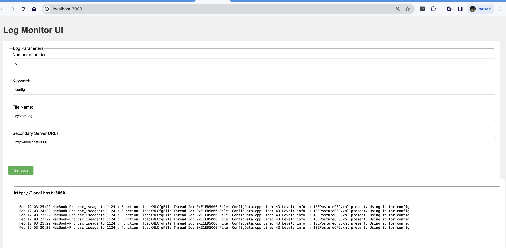
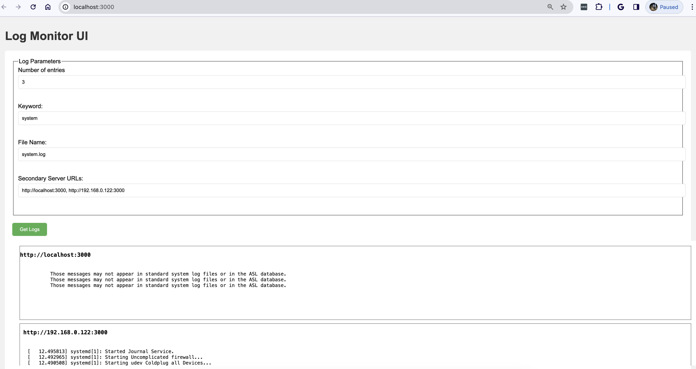

# Log Monitor Service
This service provides on-demand monitoring of various Unix-based servers without having to log into each individual machine and opening up the log files found in /var/log.

## Requirements, Design & Architecture:
Detailed information about the requirements, design, and architecture of this service can be found here: https://docs.google.com/document/d/13GyRpE5BllY1iMDoQd9ffszhTRFUfHQzeOUxAGgiXe4/edit?usp=sharing

## Implementation
1. logsRouter: Accepts the HTTP GET requests for the logs API Endpoints and directs to the logsValidator.
2. logsValidator: Validates the fileName and numEntries in the input request and directs to the logsController
3. logsController Ingress: Invokes the logService module for the request.
4. logsService: Looks up either the local logs and/or remote logs based on the serverUrls. Uses the fileOperations utility for I/O.
    Converts the response to a Response model with fields (fileName, logs, error, serverUrl and httpStatus)
4. fileOperations: Reads the stream of log data asynchronously from the local server for the given criteria and returns to logsService. 
5. logsService: Sends the resolved Promises to logsController.
5. logsController Egress: Return the data as json in the HTTP Response.

## Installation
Follow these steps to install the service:
1. Make sure npm is installed on the host.
2. Clone the repo: `git clone https://github.com/mkumble/LogMonitorService.git`
3. Install dependencies: ```cd LogMonitorService; npm install```

## Configuration
Modify the default configurations defined in `LogMonitorService/src/api/utils/constants.js` as needed (Example: change SERVER_PORT)

## Running the service
1. Follow the Installation instructions above.
2. Open the terminal and navigate to the src directory: `cd LogMonitorService/src`
3. Start the node.js application: `node app.js`. By default, the server runs on `http://localhost:3000`

## UI
After running the service, UI can be accessed on `http://localhost:3000/index.html`



## Running unit tests
1. Make sure the server is not running on localhost 3000.
2. Run `npm test` to run all the unit tests

## Committing Changes
1. Commits follow the conventional commit specification https://www.conventionalcommits.org/en/v1.0.0/#specification
2. API design is based on OpenAPI specification https://swagger.io/specification/

## APIs
#### Pre-requisite: Please follow the 'Running the service' instructions above.

### (GET) Log file lookup
```
GET /api/v1/logs
```
Retrieve a log file from local server.

**Parameters:**

| Name       | Type   | Mandatory | Description                                                                        |
|------------|--------|-----------|------------------------------------------------------------------------------------|
| fileName   | STRING | YES       | A valid fileName (in /var/logs) on the local server.                               |
| numEntries | NUMBER | NO        | Number of log lines/entries to retrieve.                                           |
| keyword    | STRING | NO        | An encoded string to search in the log file                                        |
| serverUrls | STRING | NO        | Comma separated list of server URLs. These servers must be running the application |

**Data Source:**
Filesystem

**Response:**

Response format: json

Sample Response:
```javascript
[
  {
    "server": "http://localhost:3000",
    "httpStatus": 200,
    "fileName": "system.log",
    "logs": [
      {
        "line": 1,
        "content": "Feb 14 03:12:34 MacBook-Pro csc_iseagentd[1170]: Function: sendUIStatus Thread Id: 0xE2801000 File: SwiftManager.cpp Line: 186 Level: debug :: MSG_SU_STEP_STATUS, {Status:6,Compliant:3,RemStatus:1876882848,Phase:0,StepNumber:-1,Progress:-1,Attention:0,Cancellable:0,Restartable:0,ErrorMessage:1,Description1:\"System scan not required on current Wi-Fi.\",Description2:\"\"}"
      },
      {
        "line": 2,
        "content": "Feb 14 03:12:34 MacBook-Pro csc_iseagentd[1170]: Function: getIpAndMacList Thread Id: 0xE2801000 File: SystemInfo.cpp Line: 131 Level: debug ::"
      },
      {
        "line": 3,
        "content": "Feb 14 03:12:14 MacBook-Pro csc_iseagentd[1170]: Function: sendUIStatus Thread Id: 0xE2801000 File: SwiftManager.cpp Line: 186 Level: debug :: MSG_SU_STEP_STATUS, {Status:6,Compliant:3,RemStatus:1876882848,Phase:0,StepNumber:-1,Progress:-1,Attention:0,Cancellable:0,Restartable:0,ErrorMessage:1,Description1:\"System scan not required on current Wi-Fi.\",Description2:\"\"}"
      },
      {
        "line": 4,
        "content": "Feb 14 03:12:14 MacBook-Pro csc_iseagentd[1170]: Function: getIpAndMacList Thread Id: 0xE2801000 File: SystemInfo.cpp Line: 131 Level: debug :: "
      },
      {
        "line": 5,
        "content": "Feb 14 03:12:01 MacBook-Pro csc_iseagentd[1170]: Function: sendUIStatus Thread Id: 0xE2801000 File: SwiftManager.cpp Line: 186 Level: debug :: MSG_SU_STEP_STATUS, {Status:6,Compliant:3,RemStatus:1876882848,Phase:0,StepNumber:-1,Progress:-1,Attention:0,Cancellable:0,Restartable:0,ErrorMessage:1,Description1:\"System scan not required on current Wi-Fi.\",Description2:\"\"}"
      }
    ]
  },
  {
    "server": "http://192.168.0.122:3001",
    "httpStatus": 200,
    "fileName": "system.log",
    "logs": [
      {
        "line": 1,
        "content": "[   17.566908] kernel: dcdbas dcdbas: Dell Systems Management Base Driver (version 5.6.0-3.3)"
      },
      {
        "line": 2,
        "content": "[   12.488971] systemd[1]: Starting Remount Root and Kernel File Systems..."
      },
      {
        "line": 3,
        "content": "[   12.336349] systemd[1]: Condition check resulted in File System Check on Root Device being skipped."
      },
      {
        "line": 4,
        "content": "[   12.051717] systemd[1]: Mounting Kernel Trace File System..."
      },
      {
        "line": 5,
        "content": "[   12.050303] systemd[1]: Mounting Kernel Debug File System..."
      }
    ]
  }
]
```

Happy Path:
Input | Status | Status Code | Output/Error Message
------------ | ------------ | ------------ | ------------
Valid fileName | Success | 200 | Complete logs of the file (latest to old).
Valid fileName, Valid numEntries | Success | 200 | Most Recent 'numEntries' lines of the file.
Valid fileName, Valid numEntries, Valid (URL encoded) keyword | Success | 200 | Most recent 'numEntries' lines of the file containing the keyword/text.
Valid fileName, Valid numEntries, Valid (URL encoded) keyword, Valid serverURLs | Success | 200 | Most recent 'numEntries' lines of the file containing the keyword/text for each serverURL
Valid fileName, Valid numEntries, Valid (URL encoded) keyword, Partially reachable/valid serverURLs | Success | 200 | Combination of success and error messages based on the response for each serverURL.


Errors:
Input | Status | Status Code | Output/Error Message
------------ | ------------ | ------------ | ------------
Missing fileName | Error | 400 | File name cannot be empty.
FileName containing path | Error | 400 | Path not allowed in file name.
File doesn't exist in /var/log | Error | 500 | An error occurred while reading the log file.
numEntries < 1 | Error | 400 | Number of Entries must be greater than 0.
numEntries is NaN | Error | 400 | Number of Entries query param must be a number.
serverURL is not a valid url | Error | 400 | Invalid Server URL: < invalid server url in request >
All serverURLs are unreachable/invalid | Error | 500 | Server <Server>: Error: An error occurred while reading the log file.

### Sample Requests/Response

#### Get all logs from a log file
##### Request
```text
curl "http://localhost:3000/api/v1/logs?fileName=systemshort.log"
```
##### Response

```javascript
[
  {
    "server": "http://localhost:3000",
    "httpStatus": 200,
    "fileName": "systemshort.log",
    "logs": [
      {
        "line": 1,
        "content": "Feb 14 00:12:18 MacBook-Pro csc_iseagentd[1170]: Function: collectNoMntTargets Thread Id: 0xE2801000 File: SwiftHttpRunner.cpp Line: 1214 Level: debug :: adapter en5, operStatus=1, wifi=no"
      },
      {
        "line": 2,
        "content": "Feb 14 00:12:18 MacBook-Pro csc_iseagentd[1170]: Function: collectNoMntTargets Thread Id: 0xE2801000 File: SwiftHttpRunner.cpp Line: 1214 Level: debug :: adapter en6, operStatus=1, wifi=no"
      },
      {
        "line": 3,
        "content": "Feb 14 00:12:18 MacBook-Pro csc_iseagentd[1170]: Function: collectNoMntTargets Thread Id: 0xE2801000 File: SwiftHttpRunner.cpp Line: 1214 Level: debug :: adapter en1, operStatus=1, wifi=no"
      },
      {
        "line": 4,
        "content": "Feb 14 00:12:18 MacBook-Pro csc_iseagentd[1170]: Function: collectNoMntTargets Thread Id: 0xE2801000 File: SwiftHttpRunner.cpp Line: 1214 Level: debug :: adapter en2, operStatus=1, wifi=no"
      },
      {
        "line": 5,
        "content": "Feb 14 00:12:18 MacBook-Pro csc_iseagentd[1170]: Function: collectNoMntTargets Thread Id: 0xE2801000 File: SwiftHttpRunner.cpp Line: 1214 Level: debug :: adapter en3, operStatus=1, wifi=no"
      },
      {
        "line": 6,
        "content": "Feb 14 00:12:18 MacBook-Pro csc_iseagentd[1170]: Function: collectNoMntTargets Thread Id: 0xE2801000 File: SwiftHttpRunner.cpp Line: 1214 Level: debug :: adapter bridge0, operStatus=1, wifi=no"
      },
      {
        "line": 7,
        "content": "Feb 14 00:12:18 MacBook-Pro csc_iseagentd[1170]: Function: collectNoMntTargets Thread Id: 0xE2801000 File: SwiftHttpRunner.cpp Line: 1214 Level: debug :: adapter ap1, operStatus=1, wifi=no"
      },
      {
        "line": 8,
        "content": "Feb 14 00:12:18 MacBook-Pro csc_iseagentd[1170]: Function: collectNoMntTargets Thread Id: 0xE2801000 File: SwiftHttpRunner.cpp Line: 1214 Level: debug :: adapter en0, operStatus=1, wifi=no"
      },
      {
        "line": 9,
        "content": "Feb 14 00:12:18 MacBook-Pro csc_iseagentd[1170]: Function: collectNoMntTargets Thread Id: 0xE2801000 File: SwiftHttpRunner.cpp Line: 1214 Level: debug :: adapter awdl0, operStatus=1, wifi=no"
      },
      {
        "line": 10,
        "content": "Feb 14 00:12:18 MacBook-Pro csc_iseagentd[1170]: Function: collectNoMntTargets Thread Id: 0xE2801000 File: SwiftHttpRunner.cpp Line: 1214 Level: debug :: adapter llw0, operStatus=1, wifi=no"
      },
      {
        "line": 11,
        "content": "Feb 14 00:12:18 MacBook-Pro csc_iseagentd[1170]: Function: collectNoMntTargets Thread Id: 0xE2801000 File: SwiftHttpRunner.cpp Line: 1281 Level: debug :: discarding interface utun0 with gateway fe80::"
      },
      {
        "line": 12,
        "content": "Feb 14 00:12:18 MacBook-Pro csc_iseagentd[1170]: Function: collectNoMntTargets Thread Id: 0xE2801000 File: SwiftHttpRunner.cpp Line: 1214 Level: debug :: adapter utun0, operStatus=1, wifi=no"
      },
      {
        "line": 13,
        "content": "Feb 14 00:12:18 MacBook-Pro csc_iseagentd[1170]: Function: collectNoMntTargets Thread Id: 0xE2801000 File: SwiftHttpRunner.cpp Line: 1281 Level: debug :: discarding interface utun1 with gateway fe80::"
      },
      {
        "line": 14,
        "content": "Feb 14 00:12:18 MacBook-Pro csc_iseagentd[1170]: Function: collectNoMntTargets Thread Id: 0xE2801000 File: SwiftHttpRunner.cpp Line: 1214 Level: debug :: adapter utun1, operStatus=1, wifi=no"
      },
      {
        "line": 15,
        "content": "Feb 14 00:09:38 MacBook-Pro csc_iseagentd[1170]: Function: loadXMLCfgFile Thread Id: 0xE2801000 File: ConfigData.cpp Line: 43 Level: info :: ISEPostureCFG.xml present. Using it for config"
      },
      {
        "line": 16,
        "content": "Feb 14 00:08:38 MacBook-Pro csc_iseagentd[1170]: Function: loadXMLCfgFile Thread Id: 0xE2801000 File: ConfigData.cpp Line: 43 Level: info :: ISEPostureCFG.xml present. Using it for config"
      },
      {
        "line": 17,
        "content": "Feb 14 00:07:38 MacBook-Pro csc_iseagentd[1170]: Function: loadXMLCfgFile Thread Id: 0xE2801000 File: ConfigData.cpp Line: 43 Level: info :: ISEPostureCFG.xml present. Using it for config"
      },
      {
        "line": 18,
        "content": "Feb 14 00:06:38 MacBook-Pro csc_iseagentd[1170]: Function: loadXMLCfgFile Thread Id: 0xE2801000 File: ConfigData.cpp Line: 43 Level: info :: ISEPostureCFG.xml present. Using it for config"
      },
      {
        "line": 19,
        "content": "Feb 14 00:05:38 MacBook-Pro csc_iseagentd[1170]: Function: loadXMLCfgFile Thread Id: 0xE2801000 File: ConfigData.cpp Line: 43 Level: info :: ISEPostureCFG.xml present. Using it for config"
      },
      {
        "line": 20,
        "content": "Feb 14 00:04:38 MacBook-Pro csc_iseagentd[1170]: Function: loadXMLCfgFile Thread Id: 0xE2801000 File: ConfigData.cpp Line: 43 Level: info :: ISEPostureCFG.xml present. Using it for config"
      },
      {
        "line": 21,
        "content": "Feb 14 00:03:38 MacBook-Pro syslogd[342]: ASL Sender Statistics"
      },
      {
        "line": 22,
        "content": "Feb 14 00:03:38 MacBook-Pro csc_iseagentd[1170]: Function: loadXMLCfgFile Thread Id: 0xE2801000 File: ConfigData.cpp Line: 43 Level: info :: ISEPostureCFG.xml present. Using it for config"
      },
      {
        "line": 23,
        "content": "Feb 14 00:02:38 MacBook-Pro csc_iseagentd[1170]: Function: loadXMLCfgFile Thread Id: 0xE2801000 File: ConfigData.cpp Line: 43 Level: info :: ISEPostureCFG.xml present. Using it for config"
      },
      {
        "line": 24,
        "content": "Feb 14 00:01:38 MacBook-Pro csc_iseagentd[1170]: Function: loadXMLCfgFile Thread Id: 0xE2801000 File: ConfigData.cpp Line: 43 Level: info :: ISEPostureCFG.xml present. Using it for config"
      },
      {
        "line": 25,
        "content": "Feb 14 00:00:38 MacBook-Pro csc_iseagentd[1170]: Function: loadXMLCfgFile Thread Id: 0xE2801000 File: ConfigData.cpp Line: 43 Level: info :: ISEPostureCFG.xml present. Using it for config"
      }
    ]
  }
]
```

#### Get last 3 entries from a log file
##### Request
```text
curl "http://localhost:3000/api/v1/logs?fileName=system.log&numEntries=3"
```
##### Response
```javascript
[
  {
    "server": "http://localhost:3000",
    "httpStatus": 200,
    "fileName": "system.log",
    "logs": [
      {
        "line": 1,
        "content": "Feb 14 03:22:51 MacBook-Pro csc_iseagentd[1170]: Function: loadXMLCfgFile Thread Id: 0xE2801000 File: ConfigData.cpp Line: 43 Level: info :: ISEPostureCFG.xml present. Using it for config"
      },
      {
        "line": 2,
        "content": "Feb 14 03:21:51 MacBook-Pro csc_iseagentd[1170]: Function: loadXMLCfgFile Thread Id: 0xE2801000 File: ConfigData.cpp Line: 43 Level: info :: ISEPostureCFG.xml present. Using it for config"
      },
      {
        "line": 3,
        "content": "Feb 14 03:20:51 MacBook-Pro csc_iseagentd[1170]: Function: loadXMLCfgFile Thread Id: 0xE2801000 File: ConfigData.cpp Line: 43 Level: info :: ISEPostureCFG.xml present. Using it for config"
      }
    ]
  }
]
```

#### Get last 5 entries containing the keyword from a log file
##### Request
```text
curl "http://localhost:3000/api/v1/logs?fileName=system.log&numEntries=5&keyword=Function:%20loadXML"
```
##### Response
```javascript
[
  {
    "server": "http://localhost:3000",
    "httpStatus": 200,
    "fileName": "system.log",
    "logs": [
      {
        "line": 1,
        "content": "Feb 14 03:23:51 MacBook-Pro csc_iseagentd[1170]: Function: loadXMLCfgFile Thread Id: 0xE2801000 File: ConfigData.cpp Line: 43 Level: info :: ISEPostureCFG.xml present. Using it for config"
      },
      {
        "line": 2,
        "content": "Feb 14 03:22:51 MacBook-Pro csc_iseagentd[1170]: Function: loadXMLCfgFile Thread Id: 0xE2801000 File: ConfigData.cpp Line: 43 Level: info :: ISEPostureCFG.xml present. Using it for config"
      },
      {
        "line": 3,
        "content": "Feb 14 03:21:51 MacBook-Pro csc_iseagentd[1170]: Function: loadXMLCfgFile Thread Id: 0xE2801000 File: ConfigData.cpp Line: 43 Level: info :: ISEPostureCFG.xml present. Using it for config"
      },
      {
        "line": 4,
        "content": "Feb 14 03:20:51 MacBook-Pro csc_iseagentd[1170]: Function: loadXMLCfgFile Thread Id: 0xE2801000 File: ConfigData.cpp Line: 43 Level: info :: ISEPostureCFG.xml present. Using it for config"
      },
      {
        "line": 5,
        "content": "Feb 14 03:19:51 MacBook-Pro csc_iseagentd[1170]: Function: loadXMLCfgFile Thread Id: 0xE2801000 File: ConfigData.cpp Line: 43 Level: info :: ISEPostureCFG.xml present. Using it for config"
      }
    ]
  }
]
```

#### Get last 5 entries containing the keyword from a log file for two serverURLs (both are valid)
##### Request
```text
curl "http://localhost:3000/api/v1/logs?fileName=system.log&numEntries=5&keyword=System&serverUrls=http://localhost:3000,http://192.168.0.122:3000"
```
##### Response
```javascript
[
    {
        "server": "http://localhost:3000",
        "httpStatus": 200,
        "fileName": "system.log",
        "logs": [
            {
                "line": 1,
                "content": "Feb 14 03:12:34 MacBook-Pro csc_iseagentd[1170]: Function: sendUIStatus Thread Id: 0xE2801000 File: SwiftManager.cpp Line: 186 Level: debug :: MSG_SU_STEP_STATUS, {Status:6,Compliant:3,RemStatus:1876882848,Phase:0,StepNumber:-1,Progress:-1,Attention:0,Cancellable:0,Restartable:0,ErrorMessage:1,Description1:\"System scan not required on current Wi-Fi.\",Description2:\"\"}"
            },
            {
                "line": 2,
                "content": "Feb 14 03:12:34 MacBook-Pro csc_iseagentd[1170]: Function: getIpAndMacList Thread Id: 0xE2801000 File: SystemInfo.cpp Line: 131 Level: debug ::"
            },
            {
                "line": 3,
                "content": "Feb 14 03:12:14 MacBook-Pro csc_iseagentd[1170]: Function: sendUIStatus Thread Id: 0xE2801000 File: SwiftManager.cpp Line: 186 Level: debug :: MSG_SU_STEP_STATUS, {Status:6,Compliant:3,RemStatus:1876882848,Phase:0,StepNumber:-1,Progress:-1,Attention:0,Cancellable:0,Restartable:0,ErrorMessage:1,Description1:\"System scan not required on current Wi-Fi.\",Description2:\"\"}"
            },
            {
                "line": 4,
                "content": "Feb 14 03:12:14 MacBook-Pro csc_iseagentd[1170]: Function: getIpAndMacList Thread Id: 0xE2801000 File: SystemInfo.cpp Line: 131 Level: debug ::"
            },
            {
                "line": 5,
                "content": "Feb 14 03:12:01 MacBook-Pro csc_iseagentd[1170]: Function: sendUIStatus Thread Id: 0xE2801000 File: SwiftManager.cpp Line: 186 Level: debug :: MSG_SU_STEP_STATUS, {Status:6,Compliant:3,RemStatus:1876882848,Phase:0,StepNumber:-1,Progress:-1,Attention:0,Cancellable:0,Restartable:0,ErrorMessage:1,Description1:\"System scan not required on current Wi-Fi.\",Description2:\"\"}"
            }
        ]
    },
    {
        "server": "http://192.168.0.122:3001",
        "httpStatus": 200,
        "fileName": "system.log",
        "logs": [
            {
                "line": 1,
                "content": "[   17.566908] kernel: dcdbas dcdbas: Dell Systems Management Base Driver (version 5.6.0-3.3)"
            },
            {
                "line": 2,
                "content": "[   12.488971] systemd[1]: Starting Remount Root and Kernel File Systems..."
            },
            {
                "line": 3,
                "content": "[   12.336349] systemd[1]: Condition check resulted in File System Check on Root Device being skipped."
            },
            {
                "line": 4,
                "content": "[   12.051717] systemd[1]: Mounting Kernel Trace File System..."
            },
            {
                "line": 5,
                "content": "[   12.050303] systemd[1]: Mounting Kernel Debug File System..."
            }
        ]
    }
]
```

#### Get last 5 entries containing the keyword from a log file for two serverURLs (one is invalid)
##### Request
```text
curl "http://localhost:3000/api/v1/logs?fileName=system.log&numEntries=5&keyword=Function:%20loadXML&serverUrls=http://localhost:3001,http://localhost:3000"
```
##### Response
```javascript
[
    {
        "server": "http://localhost:3000",
        "httpStatus": 200,
        "fileName": "system.log",
        "logs": [
            {
                "line": 1,
                "content": "Feb 14 03:27:52 MacBook-Pro csc_iseagentd[1170]: Function: loadXMLCfgFile Thread Id: 0xE2801000 File: ConfigData.cpp Line: 43 Level: info :: ISEPostureCFG.xml present. Using it for config"
            },
            {
                "line": 2,
                "content": "Feb 14 03:26:52 MacBook-Pro csc_iseagentd[1170]: Function: loadXMLCfgFile Thread Id: 0xE2801000 File: ConfigData.cpp Line: 43 Level: info :: ISEPostureCFG.xml present. Using it for config"
            },
            {
                "line": 3,
                "content": "Feb 14 03:25:52 MacBook-Pro csc_iseagentd[1170]: Function: loadXMLCfgFile Thread Id: 0xE2801000 File: ConfigData.cpp Line: 43 Level: info :: ISEPostureCFG.xml present. Using it for config"
            },
            {
                "line": 4,
                "content": "Feb 14 03:24:52 MacBook-Pro csc_iseagentd[1170]: Function: loadXMLCfgFile Thread Id: 0xE2801000 File: ConfigData.cpp Line: 43 Level: info :: ISEPostureCFG.xml present. Using it for config"
            },
            {
                "line": 5,
                "content": "Feb 14 03:23:51 MacBook-Pro csc_iseagentd[1170]: Function: loadXMLCfgFile Thread Id: 0xE2801000 File: ConfigData.cpp Line: 43 Level: info :: ISEPostureCFG.xml present. Using it for config"
            }
        ]
    },
    {
        "server": "http://localhost:3000",
        "serverUrl": "http://192.168.0.122:3000",
        "fileName": "system.log",
        "error": "connect ECONNREFUSED 192.168.0.122:3000"
    }
]
```
