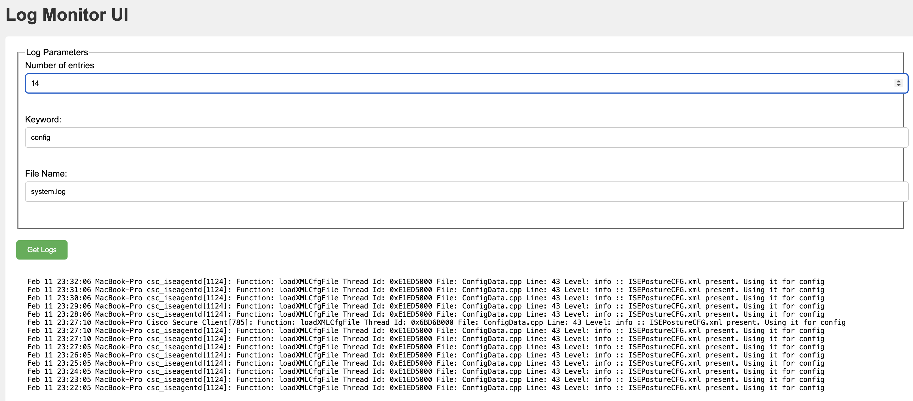

# Log Monitor Service
This service provides on-demand monitoring of various Unix-based servers without having to log into each individual machine and opening up the log files found in /var/log.

## Requirements, Design & Architecture:
Detailed information about the requirements, design, and architecture of this service can be found here: https://docs.google.com/document/d/13GyRpE5BllY1iMDoQd9ffszhTRFUfHQzeOUxAGgiXe4/edit?usp=sharing

## Implementation
1. logsRouter: Accepts the HTTP GET requests for the logs API Endpoints and directs to the logsValidator.
2. logsValidator: Validates the fileName and numEntries in the input request and directs to the logsController
2. logsController Ingress: Invokes the fileOperations module for the request.
3. fileOperations: Reads the stream of log data asynchronously from the local server for the given criteria and returns to logsController. 
3. logsController Egress: Return the data as text/html in the HTTP Response.

## Installation
Follow these steps to install the service:
1. Clone the repo: `git clone git@github.com:mkumble/LogMonitorService.git`
2. Install dependencies: ```cd LogMonitorService; npm install```

## Configuration
Modify the default configurations defined in `LogMonitorService/src/api/utils/constants.js` as needed.

## Running the service
1. Follow the Installation instructions.
2. Open the terminal and navigate to the src directory: `cd LogMonitorService/src`
3. Start the node.js application: `node app.js`. By default, the server runs on `http://localhost:3000`

## UI
After running the service, UI can be accessed on `http://localhost:3000/index.html`


## Running unit tests
1. Make sure the server is not running on localhost 3000.
2. Run `npm test` to run all the unit tests

## Commiting Changes
1. Commits follow the conventional commit specification https://www.conventionalcommits.org/en/v1.0.0/#specification
2. API design is based on OpenAPI specification https://swagger.io/specification/

## APIs
#### Pre-requisite: Please follow the 'Running the service' instructions above.

### (GET) Log file lookup
```
GET /api/v1/logs
```
Retrieve a log file from local server.

**Parameters:**

| Name       | Type   | Mandatory | Description                                                                        |
|------------|--------|-----------|------------------------------------------------------------------------------------|
| fileName   | STRING | YES       | A valid fileName (in /var/logs) on the local server.                               |
| numEntries | NUMBER | NO        | Number of log lines/entries to retrieve.                                           |
| keyword    | STRING | NO        | An encoded string to search in the log file                                        |
| serverUrls | STRING | NO        | Comma separated list of server URLs. These servers must be running the application |

**Data Source:**
Filesystem

**Response:**
Happy Path:
Input | Status | Status Code | Output/Error Message
------------ | ------------ | ------------ | ------------
Valid fileName | Success | 200 | Complete logs of the file (latest to old).
Valid fileName, Valid numEntries | Success | 200 | Most Recent 'numEntries' lines of the file.
Valid fileName, Valid numEntries, Valid (URL encoded) keyword | Success | 200 | Most recent 'numEntries' lines of the file containing the keyword/text.
Valid fileName, Valid numEntries, Valid (URL encoded) keyword, Valid serverURLs | Success | 200 | Most recent 'numEntries' lines of the file containing the keyword/text for each serverURL
Valid fileName, Valid numEntries, Valid (URL encoded) keyword, Partially reachable/valid serverURLs | Success | 200 | Combination of success and error messages based on the response for each serverURL.


Errors:
Input | Status | Status Code | Output/Error Message
------------ | ------------ | ------------ | ------------
Missing fileName | Error | 400 | File name cannot be empty.
FileName containing path | Error | 400 | Path not allowed in file name.
File doesn't exist in /var/log | Error | 500 | An error occurred while reading the log file.
numEntries < 1 | Error | 400 | Number of Entries must be greater than 0.
numEntries is NaN | Error | 400 | Number of Entries query param must be a number.
All serverURLs are unreachable/invalid | Error | 500 | Server <Server>: Error: An error occurred while reading the log file.

### Sample Requests/Response

#### Get all logs from a log file
##### Request
```text
curl "http://localhost:3000/api/v1/logs?fileName=system.log"
```
##### Response
```
Feb 11 20:38:05 MacBook-Pro csc_iseagentd[1124]: Function: loadXMLCfgFile Thread Id: 0xE1ED5000 File: ConfigData.cpp Line: 43 Level: info :: ISEPostureCFG.xml present. Using it for config
Feb 11 20:37:05 MacBook-Pro csc_iseagentd[1124]: Function: loadXMLCfgFile Thread Id: 0xE1ED5000 File: ConfigData.cpp Line: 43 Level: info :: ISEPostureCFG.xml present. Using it for config
Feb 11 20:36:05 MacBook-Pro csc_iseagentd[1124]: Function: loadXMLCfgFile Thread Id: 0xE1ED5000 File: ConfigData.cpp Line: 43 Level: info :: ISEPostureCFG.xml present. Using it for config
```

#### Get last 3 entries from a log file
##### Request
```text
curl "http://localhost:3000/api/v1/logs?fileName=system.log&numEntries=3"
```
##### Response
```
Feb 11 20:41:05 MacBook-Pro csc_iseagentd[1124]: Function: loadXMLCfgFile Thread Id: 0xE1ED5000 File: ConfigData.cpp Line: 43 Level: info :: ISEPostureCFG.xml present. Using it for config
Feb 11 20:40:05 MacBook-Pro csc_iseagentd[1124]: Function: loadXMLCfgFile Thread Id: 0xE1ED5000 File: ConfigData.cpp Line: 43 Level: info :: ISEPostureCFG.xml present. Using it for config
Feb 11 20:39:05 MacBook-Pro csc_iseagentd[1124]: Function: loadXMLCfgFile Thread Id: 0xE1ED5000 File: ConfigData.cpp Line: 43 Level: info :: ISEPostureCFG.xml present. Using it for config
```

#### Get last 5 entries containing the keyword from a log file
##### Request
```text
curl "http://localhost:3000/api/v1/logs?fileName=system.log&numEntries=5&keyword=Function:%20loadXML"
```
##### Response
```
Feb 11 20:43:06 MacBook-Pro csc_iseagentd[1124]: Function: loadXMLCfgFile Thread Id: 0xE1ED5000 File: ConfigData.cpp Line: 43 Level: info :: ISEPostureCFG.xml present. Using it for config
Feb 11 20:42:05 MacBook-Pro csc_iseagentd[1124]: Function: loadXMLCfgFile Thread Id: 0xE1ED5000 File: ConfigData.cpp Line: 43 Level: info :: ISEPostureCFG.xml present. Using it for config
Feb 11 20:41:05 MacBook-Pro csc_iseagentd[1124]: Function: loadXMLCfgFile Thread Id: 0xE1ED5000 File: ConfigData.cpp Line: 43 Level: info :: ISEPostureCFG.xml present. Using it for config
Feb 11 20:40:05 MacBook-Pro csc_iseagentd[1124]: Function: loadXMLCfgFile Thread Id: 0xE1ED5000 File: ConfigData.cpp Line: 43 Level: info :: ISEPostureCFG.xml present. Using it for config
Feb 11 20:39:05 MacBook-Pro csc_iseagentd[1124]: Function: loadXMLCfgFile Thread Id: 0xE1ED5000 File: ConfigData.cpp Line: 43 Level: info :: ISEPostureCFG.xml present. Using it for config
```

#### Get last 5 entries containing the keyword from a log file for two serverURLs (one is invalid)
##### Request
```text
curl "http://localhost:3000/api/v1/logs?fileName=system.log&numEntries=5&keyword=Function:%20loadXML&serverUrls=http://localhost:3001,http://localhost:3000"
```
##### Response
```
Server http://localhost:3001:
Error: An error occurred while reading the log file.

Server http://localhost:3000:
Logs:
Feb 12 01:10:13 MacBook-Pro csc_iseagentd[1124]: Function: loadXMLCfgFile Thread Id: 0xE1ED5000 File: ConfigData.cpp Line: 43 Level: info :: ISEPostureCFG.xml present. Using it for config
Feb 12 01:09:13 MacBook-Pro csc_iseagentd[1124]: Function: loadXMLCfgFile Thread Id: 0xE1ED5000 File: ConfigData.cpp Line: 43 Level: info :: ISEPostureCFG.xml present. Using it for config
Feb 12 01:08:13 MacBook-Pro csc_iseagentd[1124]: Function: loadXMLCfgFile Thread Id: 0xE1ED5000 File: ConfigData.cpp Line: 43 Level: info :: ISEPostureCFG.xml present. Using it for config
Feb 12 01:07:13 MacBook-Pro csc_iseagentd[1124]: Function: loadXMLCfgFile Thread Id: 0xE1ED5000 File: ConfigData.cpp Line: 43 Level: info :: ISEPostureCFG.xml present. Using it for config
Feb 12 01:06:12 MacBook-Pro csc_iseagentd[1124]: Function: loadXMLCfgFile Thread Id: 0xE1ED5000 File: ConfigData.cpp Line: 43 Level: info :: ISEPostureCFG.xml present. Using it for config```
